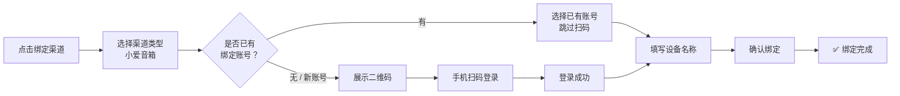

# 小爱音箱推送渠道配置指南#

本教程将指导你如何在 MagicPush（魔法推送）中配置**小爱音箱**推送渠道，实现向小爱音箱发送语音播报通知。

## 概述#

### 什么是小爱音箱推送？

通过 **xiaoii** 底层 Speaker 模块，MagicPush 可以直接调用小米 IoT API，将文本消息发送至小爱音箱进行**语音播报**。

> ⚠️ **重要**：这是**语音播报**渠道，消息会以**语音**形式从小爱音箱播放出来，不是文字通知。

| 特点 | 说明 |
|------|------|
| 推送目标 | 小爱音箱（需在同一小米账号下） |
| 鉴权方式 | 扫码登录（自动获取凭证），无需手动填写账号密码 |
| 配置复杂度 | 简单，只需扫码 + 填写设备名称即可 |
| 消息格式 | text（纯文本，自动转为语音） |
| 额外功能 | TTS 模式选择（auto/command/default）、复用已有账号 |

### 前置条件#

- 拥有**小米账号**和**小爱音箱**设备
- 已部署并登录 MagicPush 管理后台
- 准备一部**小米手机**或安装了**米家 App** 的手机（用于扫码）

---

## 绑定流程总览#

小爱音箱的绑定采用**扫码登录**方式，整体流程如下：



---

## 详细步骤#

### 第一步：发起绑定#

1. 登录 MagicPush 管理后台
2. 点击左侧导航 **「渠道管理」**
3. 点击右上角 **「+ 绑定渠道」** 按钮#
4. 在弹出的对话框中，从渠道类型下拉列表中选择 **「小爱音箱」**

选择后不会出现常规的表单字段，而是显示以下引导：

> **小爱音箱需要通过小米账号扫码登录完成绑定，点击下方按钮开始**

5. 点击 **「扫码登录绑定」** 按钮

### 第二步：选择登录方式#

弹出扫码绑定弹窗后，系统会自动检测你是否已经绑定过小爱音箱渠道：

#### 情况 A：已有绑定账号（复用账号）

如果你之前已经绑定过小爱音箱，系统会列出已有的小米账号：

```
┌─────────────────────────────────────┐
│  选择已登录的小米账号                 │
│                                     │
│  ○ 小米账号 (1234567890)    ✓       │
│     已绑定 2 个设备                │
│                                     │
│  ──────────── 或 ──────────────      │
│                                     │
│  [ 扫码登录新的小米账号 ]             │
└─────────────────────────────────────┘
```

- 直接选中已有账号，点击 **「使用选中的账号」**
- 跳过扫码步骤，直接进入**第四步：配置设备**

#### 情况 B：首次绑定 / 使用新账号#

如果没有已有账号，或你想使用新的小米账号：

1. 点击 **「扫码登录新的小米账号」**（首次绑定时也会自动跳转到此步骤）
2. 系统开始获取登录二维码

### 第三步：扫码登录小米账号#

界面将展示二维码和操作提示：

```
┌─────────────────────────────────────┐
│                                     │
│   请使用小米手机/米家APP            │
│   扫描下方二维码登录小米账号         │
│                                     │
│          ┌──────────┐               │
│          │   二维码  │               │
│          │          │               │
│          └──────────┘               │
│                                     │
│  ⏳ 等待扫码中...                   │
│  ⚠️ 二维码有效期约 5 分钟           │
│                                     │
│  无法扫码？点击链接手动登录：        │
│  https://account.xiaomi.com/...     │
└─────────────────────────────────────┘
```

1. 打开**小米手机**上的 **「米家 App」** 或 **「小米账号」** App
2. 使用**扫一扫功能**扫描屏幕上的二维码
3. 在手机上**确认登录**

> 💡 **提示**：
> - 如果手机无法扫码，可以点击页面中的链接，在浏览器中手动完成登录
> - 二维码有效期为 **5 分钟**，过期后可点击 **「刷新二维码」** 重新获取
> - 扫码过程中请勿关闭弹窗，系统会自动检测登录状态

### 第四步：配置设备信息#

扫码登录成功后，进入设备配置页面：

| 字段 | 说明 | 必填 | 示例 |
|------|------|------|------|
| **设备名称** | 米家 App 中小爱音箱的设备名称，必须**完全一致** | ✅ 是 | `客厅小爱`、`卧室音箱` |
| **渠道名称** | 给该渠道起的别名，方便管理 | ❌ 否 | `客厅小爱音箱`（默认 `小爱音箱`） |
| **TTS 模式** | 语音播报模式 | ❌ 否 | `auto`（推荐） |
| **在线音频 URL** | 填写现有直链，或上传本地音频后自动生成 | ❌ 否 | `https://push.example.com/api/media/...` |

> ⚠️ **重要 - 设备名称匹配规则**：
> - 设备名称必须与**米家 App 中显示的名称完全一致**
> - 注意区分**大小写、全角/半角字符、空格**
> - 例如：米家 App 中是 `客厅 小爱`（中间有空格），这里也要填带空格的

> 💡 **TTS 模式说明**：
>
> | 模式 | 说明 | 推荐场景 |
> |------|------|----------|
> | `auto`（推荐） | 智能选择最优 TTS 方式 | 大多数场景 |
> | `command` | 仅使用 MiOT 指令 | auto 模式失败时尝试 |
> | `default` | 仅使用 MiNA 默认链路 | 特殊兼容需求 |

填写完成后，点击 **「确认绑定」**。

### 上传在线音频#

在“在线音频 URL”一栏点击 **「上传音频」**，可将本地音频保存到 MagicPush 服务器。上传完成后系统会自动填写可供小爱音箱拉取的在线地址，并提供试听控件。

- 支持 MP3、WAV、OGG、FLAC、M4A、AAC，推荐使用兼容性最好的 MP3
- 默认单文件最大 20MB
- 文件保存在服务端持久化数据卷中，更新容器不会丢失
- 配置在线音频后会优先播放音频，不再播报本次推送文本；音频播放失败且有文本时会自动降级为 TTS
- 使用 HTTPS 域名或多层反向代理部署时，需要配置 `PUBLIC_BASE_URL`，确保生成的地址能被音箱访问

### 第五步：绑定完成#

```
┌─────────────────────────────────────┐
│                                     │
│           ✅ 绑定成功                │
│                                     │
│      已绑定到「客厅小爱音箱」        │
│                                     │
│          [ 完成 ]                    │
└─────────────────────────────────────┘
```

点击 **「完成」** 关闭弹窗，渠道列表中将出现新添加的小爱音箱渠道。

---

## 测试连通性#

渠道创建成功后：

1. 在渠道卡片右侧，点击 **「⋮」** 下拉菜单
2. 点击 **「测试」** 按钮
3. 观察小爱音箱是否播报测试消息

- ✅ 如果小爱音箱播报 **「这是一条来自魔法推送的测试消息」**，说明配置成功
- ❌ 如果测试失败，请参考下方 [常见问题](#常见问题) 排查

> 💡 **提示**：语音播报可能有 **1-3 秒延迟**，请耐心等待。

---

## 重新绑定#

如果小爱音箱推送出现问题（如 token 过期、更换设备等），可以通过**重新绑定**快速修复：

1. 在渠道列表中找到对应的小爱音箱渠道
2. 点击右侧 **「⋮」** → **「重新绑定」**
3. 弹出与新建相同的扫码绑定弹窗
4. 完成扫码登录并确认新设备即可

> 📌 **注意**：重新绑定只会更新认证信息和设备配置，不会创建新渠道。

---

## 使用推送#

### 通过 API 推送#

创建渠道后，可以通过 MagicPush 的标准 API 进行推送：

```bash
curl -X POST http://<服务器IP>:3000/api/push/<渠道ID> \
  -H "Content-Type: application/json" \
  -H "Authorization: Bearer <你的API Token>" \
  -d '{
    "title": "系统告警",
    "content": "服务器 CPU 使用率超过 90%，请及时处理",
    "type": "text"
  }'
```

> 📌 小爱音箱**只支持 `text` 类型**，`markdown` 和 `html` 类型会自动转换为纯文本。

### 消息内容建议#

由于消息会以**语音**形式播报：

1. **简洁明了**：避免使用特殊符号、Markdown 标记
2. **避免过长**：语音播报过长体验不佳，建议 **500 字符以内**
3. **使用口语化表达**：如「服务器 CPU 使用率超过百分之九十」比「CPU > 90%」更易听懂

MagicPush 会自动：
- 将 Markdown 转为纯文本
- 将 HTML 转为纯文本
- 截断超过 500 字符的内容（小爱 TTS 有长度限制）

---

## 技术细节#

### 消息长度限制#

- 小爱音箱 TTS：**500 字符**（超过自动截断）

### 认证机制#

本方案采用**扫码登录**方式自动获取认证凭据，无需用户手动填写：

| 传统方式（已弃用） | 当前扫码方式 |
|-------------------|-------------|
| 手动查找小米 ID | ✅ 扫码自动获取 |
| 手动获取 PassToken | ✅ 自动提取 Token |
| 手动输入密码 | ✅ 无需密码 |
| 可能因安全验证拦截 | ✅ 官方 OAuth 流程，稳定可靠 |

### 认证过期处理#

- 如果认证过期（token 失效），MagicPush 会自动尝试重新初始化
- 若自动恢复失败，可通过 **「重新绑定」** 刷新认证状态

---

## 常见问题#

### Q: 扫码后一直显示「等待扫码中」，没有反应？

**可能原因及解决**：

1. 手机扫码后未在 App 中 **点击确认登录** —— 请检查手机操作
2. 二维码已过期（有效期 5 分钟）—— 点击 **「刷新二维码」** 重新获取
3. 网络连接异常 —— 检查服务器网络是否能访问小米 API
4. 浏览器控制台有报错 —— 按 F12 查看 Network 面板是否有请求失败

### Q: 提示「设备未找到」或「绑定失败」？

**原因**：设备名称与米家 App 中不一致。

**解决**：
1. 打开**米家 App**，找到你的小爱音箱
2. **精确复制**设备名称（包括空格、大小写）
3. 在配置页面粘贴填入

> 💡 如果不确定准确名称，可以在米家 App 的设备详情页查看。

### Q: 一个小米账号可以绑定多个设备吗？

**可以**。每个小爱音箱设备作为**独立的渠道**存在：

- 同一账号可以绑定多个不同的小爱音箱（如客厅、卧室各一个）
- 绑定时只需在 **「设备名称」** 字段填写不同的设备名即可
- 复用已有账号时可以看到当前账号已绑定的设备数量

### Q: 小爱音箱没有播报消息？

**排查步骤**：

1. 确认小爱音箱在线（通电、联网正常）
2. 在渠道列表中点击 **「测试」** 发送测试消息
3. 确认设备名称是否正确匹配
4. 检查 MagicPush 日志是否有错误信息
5. 尝试 **「重新绑定」** 刷新认证状态

### Q: 语音播报内容不清晰？

**原因**：消息内容包含特殊符号或过长。

**解决**：
1. 简化消息内容，使用口语化表达
2. 避免使用特殊符号（`%`、`#`、`@` 等）
3. 控制消息长度在 **100 字符以内** 效果最佳

### Q: 如何切换 TTS 模式？

编辑渠道即可修改 TTS 模式：

1. 点击渠道卡片的 **「编辑」**
2. 修改 **TTS 模式** 字段
3. 保存

或在**重新绑定**时一并修改。

### Q: 可以同时绑定多个小米账号吗？

**可以**。每次扫码登录不同的小米账号，系统会分别保存各账号的认证信息，互不影响。在选择账号界面可以看到所有已登录过的账号。

---

## 参考资源#

- [xiaoii GitHub](https://github.com/yihong0618/xiaogpt)
- [小米 IoT 开放平台](https://iot.mi.com/)
- [MagicPush GitHub 仓库](https://github.com/magiccode1412/magicpush)
